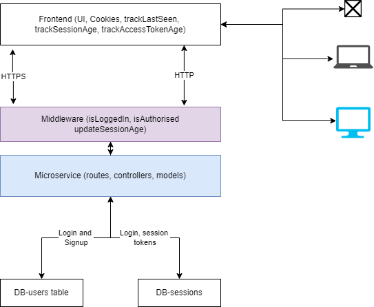

# User Management App with user activity monitoring.
    - Tracks user activity
    - Tracks session token expiry
    - Auto-requests for new token using refresh token
    - Logs user out in case of too long inactivity periods
## High level Design

</img>

## Routes
### Public
### User details management 
+ a. Sign up 
    1.  Receive - email, firstName, lastName, password 
        * Check if email exists
        * Encrypt password
        * Generate 6-digit verification code
        * Insert user candidate into DB
        * Send verification link to registered email
    2. Return - success message or error message
+ b. Verify email
    1. Receive verification code
        * Retrieve 6-digit verification code from request
        * Retrieve verification code from user table
        * Compare verification codes
        * Update user table set verified to true
    2. Return success message
+ Resend verification link
    1. Receive - email address
        * Check if email is registered
        * Generate 6-digit integer
        * Update users table with new code
        * Send code to email
    2. return error message
+ Login
    1. Receives email and password.
        * Fetch password from user table using email
        * Compare DB password with received password
        * Generate a refresh_token, you can use UUIDV4, with 24hr expiry
        * Insert session info into session table
        * Generate JWT token using email and sessionID as payload
        * Return access_token, refresh_token 
    2. Returns access_token, refresh_token or error message.
+ Logout
    1. Retrieve sessionID from request
        * Set refresh_token as null
        * Update session table, set is_valid to false
    2. End session
### Private
#### Session management
* Renew token
    1. Receives refresh_token
        + Fetch refresh_token from sessions table
        + Check that refresh_token is valid
        + Compare refresh_token to received token
        + Generate new JWT access_token using email and sessionID 
        + Returns new access_token
### Middleware
* Check authentication
    1. Retrieve access_token from request header
    2. Verify that access_token is valid
    3. Decode access_token
    4. Set data ( sessionID, email ) to req.locals.session
* Check authorization
    1. ::: To be added
### Frontend
* Track age of token
* Track last seen 
    <code>
        If age of token is nearing maxAgeOfToken = 1hr ( 50 min < ageOfToken < 55min ): 
            If lastSeen < 50minutes: 
                Request new token using refresh_token
                reset age of token
            Else:
                alert user: You're about to be logged out.
        else if ageOfToken > 55 minutes:
            If lastSeen >= 50 minutes:
                logoutUser
                Call logout endpoint
    </code>
    
            

## Data Model
### Table: User Details Management

- `Name`: users
- `Comment`: Managing users' login information

#### `Primary Key`

- `Columns`: userID
- `Cluster`: `false`

#### `Indexes[]`

| `Columns` | `Unique` | `Cluster` |
| --------- | -------- | --------- |
|  email    | `true`   | `false`   |

#### `Foreign Keys[]`

| `Columns` | `Ref Table` | `Ref Columns` | `Options` |
| --------- | ----------- | ------------- | --------- |
| userId    | user_session| user_session.user|           |

#### `Columns[]`

| `Name`    | `Label`    | `Type`       | `Nullable` | `Default` | `Comment`       |
| --------- | ---------- | ------------ | ---------- | --------- | --------------- |
| userID    | UserID     | int          | `false`    |           | user ID   |
| email     | User_Email | nvarchar(50) | `false`    | ''        | User's email, unique to a user |
| email_verification_token| Token to verify email | nvarchar(50) | `false`    | ''        | Verifying email is owners |
| first_name| First_Name | nvarchar(50) | `false`    | ''        | User's first name |
| last_name | Last_Name  | nvarchar(50) | `false`    | ''        | User's last name |
| password  | Password   | nvarchar(50) | `false`    | ''        | Password |
| email_is_verified| Email_is_Verified | nvarchar(50)| `false` | ''   | If user has verified the email address |
| creation_timestamp| Creation_Timestamp | datetime | `false`    |Date.now()| Timestamp for when a user is created |
| last_modified_timestamp| Last_Modified_Timestamp | datetime | `true`|Date.now()| Timestamp for when a user makes changes |

### Table: Session Details Management

- `Name`: sessions
- `Comment`: Managing refresh tokens

#### `Primary Key`

- `Columns`: sessionID
- `Cluster`: `false`

#### `Indexes[]`

| `Columns` | `Unique` | `Cluster` |
| --------- | -------- | --------- |
|  refresh_token | `true`   | `false`   |

#### `Foreign Keys[]`

| `Columns` | `Ref Table` | `Ref Columns` | `Options` |
| --------- | ----------- | ------------- | --------- |
| sessionID | user_session| session.sessionID |           |

#### `Columns[]`

| `Name`    | `Label`    | `Type`       | `Nullable` | `Default` | `Comment`       |
| --------- | ---------- | ------------ | ---------- | --------- | --------------- |
| sessionID    | UserID     | int          | `false`    |           | session ID   |
| age    | Session_Age     | int          | `false`    |           | Minutes since login   |
| refresh_token| Refresh_Token | nvarchar(50) | `false`    | ''        | Refresh Token for each login session |
| is_valid| Token_is_Valid | nvarchar(50) | `false`    | ''        | Refresh token is not expired |
| creation_timestamp| Creation_Timestamp | datetime | `false`    |Date.now()| Timestamp for when a session starts is created |
| sessionID    | UserID     | int          | `false`    |           | session ID   |

### Table: User sessions

- `Name`: user_sessions
- `Comment`: User sessions

#### `Primary Key`

- `Columns`: ID
- `Cluster`: `false`

#### `Indexes[]`

| `Columns` | `Unique` | `Cluster` |
| --------- | -------- | --------- |
|  userID    | `true`   | `false`   |
|  sessionID    | `true`   | `false`   |

#### `Foreign Keys[]`

| `Columns` | `Ref Table` | `Ref Columns` | `Options` |
| --------- | ----------- | ------------- | --------- |
| userId    | users| user.userID|           |
| sessionId    | sessions| session.sessionID|           |

#### `Columns[]`

| `Name`    | `Label`    | `Type`       | `Nullable` | `Default` | `Comment`       |
| --------- | ---------- | ------------ | ---------- | --------- | --------------- |
| ID    | UserID     | int          | `false`    |           | unique ID   |
| userId     | user  | nvarchar(50) | `false`    | ''        | user ID |
| sessionId| session | nvarchar(50) | `false`    | ''        | Session ID |

